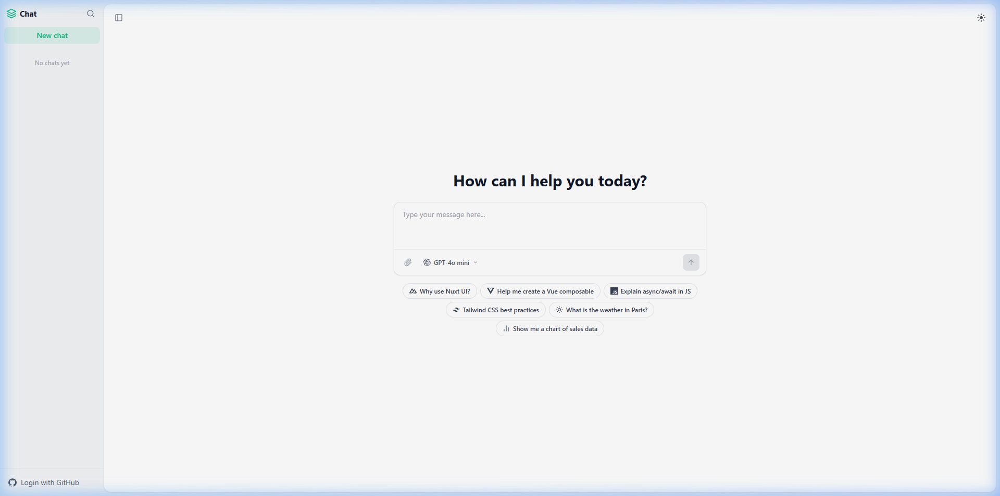

<p align="center">
  
</p>

# Laravel + Nuxt AI Chatbot

A modern, full-stack AI chatbot implementation integrated tightly into a solid Laravel and Nuxt 3 boilerplate. It utilizes the powerful **Vercel AI SDK** to intelligently handle dynamic streaming, context attachment handling, and tool-calling invocations rendered beautifully as Vue Components.

## ✨ Features
- **Nitro Server API**: Dedicated fast route endpoints strictly managing memory histories using SQLite and Drizzle ORM. No third-party DB service needed.
- **Dynamic AI Tool Calling**: Capable of autonomously injecting visually rich UI Components natively to chat history natively (Default features include: Live Weather Widget & Interactive Chart Widget).
- **Auto-Generate Titles**: Automatically summarizes your very first chat prompt contextual message into a brief session label dynamically upon first prompt.
- **Model Selection Mechanism**: Toggle among industry-leading Models natively via the UI Dropdown (GPT-4o, Claude 3.5 Haiku, Gemini 2.0 Flash) without losing the session context.
- **Multi-File Context Attachments**: Effortlessly upload multiple file constraints through the paperclip interface for multimodal prompting.

## 🚀 Getting Started

1. Set up your Vercel AI Gateway Key in `.env`:
```bash
AI_GATEWAY_API_KEY=your_vercel_gateway_key
```

2. Boot the Nitro backend's SQLite scheme and Drizzle Migration:
```bash
npx tsx server/db/init.ts
```

3. Launch your Nuxt frontend:
```bash
bun dev
```

Visit [`http://localhost:3000`](http://localhost:3000). You will be directly served with the default Chat UI interface. Enjoy!
