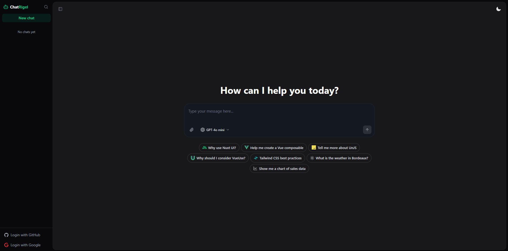

<p align="center">
  
    
</p>

# ChatRigel AI Assistant (Laravel + Nuxt 3)

Membangun fondasi chatbot AI modern dan _full-stack_ yang terintegrasi erat dengan *boilerplate* Laravel dan Nuxt 3. Dibangun dengan memanfaatkan kecanggihan **Vercel AI SDK** untuk mengelola aliran dinamis (_streaming_), memproses lampiran konteks multi-berkas, serta memicu pemanggilan alat (Tool-Calling) yang divisualisasikan secara menawan dalam wujud Komponen Vue.

## ✨ Fitur Utama
- **Estetika Nuxt UI Template Asli**: Aplikasi ini secara mulus menduplikasi tata letak resmi Nuxt UI Chat, menghadirkan *input box* elegan, *toggle* pemilihan model AI, cip sugesti beranimasi, dan tipografi logo sidebar yang serasi.
- **Pemilihan Model Otomatis**: Ganti model AI kelas industri pilihan Anda secara instan dari *dropdown* antarmuka (GPT-4o, Claude 3.5 Haiku, Gemini 2.0 Flash) tanpa harus kehilangan riwayat percakapan.
- **Lampiran Konteks Multi-Berkas**: Unggah beragam batasan berkas langsung melalui ikon penjepit kertas (*paperclip*) untuk kebutuhan pemrosesan perintah canggih (Multimodal prompt).
- **Tool Calling Dinamis**: AI mampu secara otonom menyuntikkan Visual UI Component kaya fitur tepat di dalam barisan obrolan (Contoh standar bawaan: _Widget_ Cuaca Langsung & Bagan Interaktif).
- **Judul Terbuat Otomatis**: Secara otomatis merangkum perintah pertama dari pesan Anda untuk menjadi label deskriptif di riwayat *sidebar*.
- **API Server Nitro**: Menggunakan Endpoint khusus dan cepat untuk mengelola rekam memori berbantuan SQLite dan Drizzle ORM. Tidak butuh konfigurasi layanan DB pihak ketiga.

---

## 🚀 Panduan Instalasi Lokal

Ikuti langkah-langkah di bawah ini untuk memulai ChatRigel di peranti Anda dari nol:

### 1. Kloning Repositori
Jalankan proses *clone* proyek ini ke *directory* mesin lokal Anda:
```bash
git clone https://github.com/rigel-sayudha/chatrigel.git
cd chatrigel
```

### 2. Instalasi Dependensi (Package Manager)
Instal seluruh kepustakaan untuk lingkungan pengembangan Nuxt menggunakan npm, bun, atau pnpm.
```bash
npm install
# atau
bun install
```

### 3. Konfigurasi Lingkungan Lingkungan (.env)
Salin berkas prasetel konfigurasi `.env.example` lalu ubah menjadi `.env`.
```bash
cp .env.example .env
```
Buka `.env` dan masukkan kata kunci **AI Gateway API Key** dari Vercel Anda agar model-model bahasa dapat merespons:
```env
AI_GATEWAY_API_KEY=kunci_vercel_gateway_milik_anda
```

### 4. Siapkan Basis Data (Drizzle + SQLite)
Lakukan *seeding* dan migrasi skema profil Nitro ke _database_ SQLite lokal. Cukup jalankan:
```bash
npx tsx server/db/init.ts
```

### 5. Jalankan Server Pengembangan
Terakhir, luncurkan sistem antarmuka Nuxt dan backend Nitro Anda:
```bash
npm run dev
# atau
bun dev
```

Kunjungi **[http://localhost:3000](http://localhost:3000)** pada tab peramban/browser Anda. Layar obrolan utama ChatRigel siap bertugas merespons setiap sapaan! 🤖
